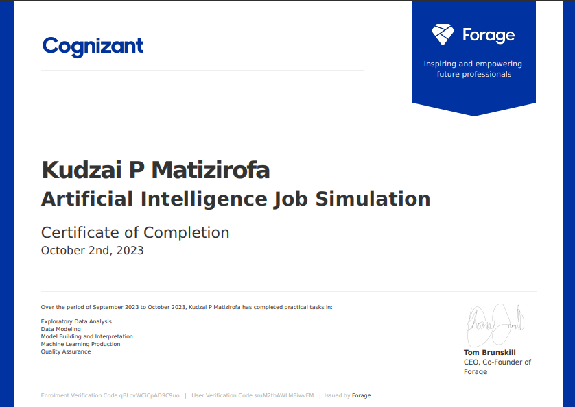

# What is the forage ?
Forage offers free, very-short virtual work experiences, which are online programs designed and delivered by leading 
companies. Each virtual work experience contains a series of resources and tasks designed to simulate the real-world experience of starting a career

## What is Cognizant ?
Cognizant is a tech based company that helps companies modernize technology, reimagine processes and transform experiences, 
so they stay ahead in a fast-changing world.

## Cognizant Artificial Intelligence Virtual Experience
Task One: Exploratory Data Analysis
* Analysed sales data via Python.

Task Two: Data Modelling
* Reviewed a data model diagram. 
* Created a plan to answer the client problem statement. 
* Created one PowerPoint slide to share plan with my leader.

Task Three: Model Building and Interpretation
* Used Python to build a data model.

Task Four: Machine Learning Production.
* Wrote a Python module to train a model and output performance metrics.

## The work includes an entire workflow for a data science
* Data insights
* CRISP-DM
* Data cleaning
* Feature Engineering
* Data Visualisation
* Machine Learning
* Python
* Communication
* Quality Assurance
* Evaluation
* Interpretability

> My certificate

   

